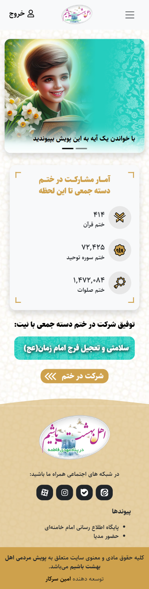
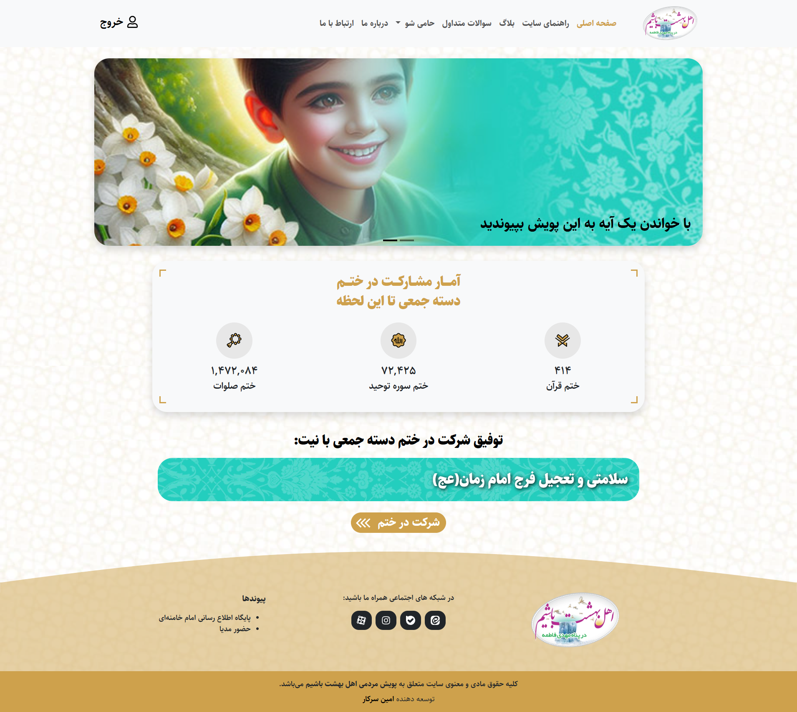
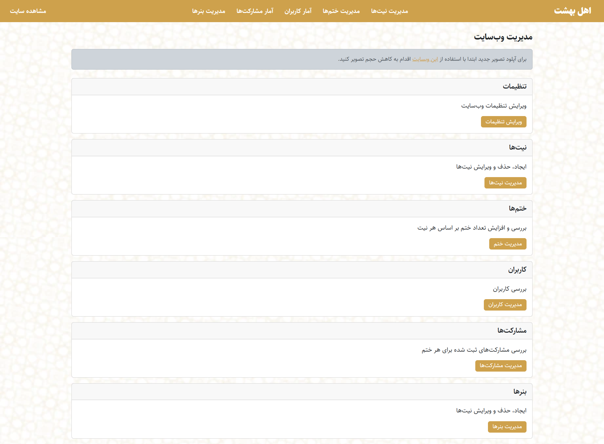

# وب‌سایت اهل بهشت

**نوع پروژه:** وب‌اپلیکیشن فول‌استک  
**مشتری / کارفرما:** پروژه خصوصی برای یک مشتری

---

## 🎯 هدف پروژه

ارائه وب‌سایت قرآنی برای ختم آنلاین قرآن، صلوات و سوره توحید به صورت جمعی و یکپارچه

---

## 🔧 تکنولوژی‌ها و ابزارها

- Python (Django)
- JavaScript (jQuery, SlimSelect)
- MySQL
- Bootstrap

---

## 🧠 نقش من در پروژه

پیاده‌سازی کامل فرانت‌اند و بک‌اند، راه‌اندازی و پشتیبانی وب‌سایت

---

## 🖼️ تصاویر / دموی پروژه

  
  

---

## 🚫 دسترسی به کد

کد پروژه به دلیل رعایت حریم خصوصی مشتری به صورت خصوصی نگه‌داری می‌شود.  
با این حال، وب‌سایت در [https://ahlebehesht.ir/](https://ahlebehesht.ir/) در دسترس است.

---

## 🧩 ویژگی‌های کلیدی پروژه

- هماهنگ‌سازی ختم جمعی با ۴ روش ختم جزء، حزب، صفحه و آیه
- داشبورد مدیریتی با فیلتر، جست‌وجو و آمارگیری
- امکان بارگذاری تصاویر و مدیریت فایل‌ها
- کاملاً ریسپانسیو و قابل استفاده در موبایل
