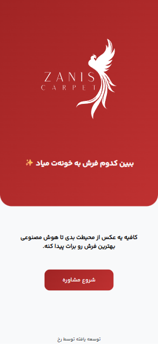
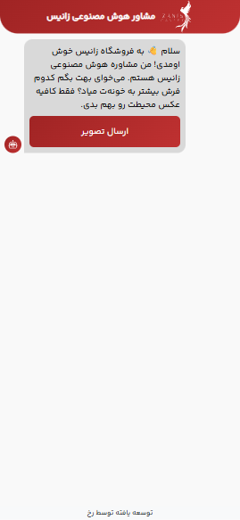
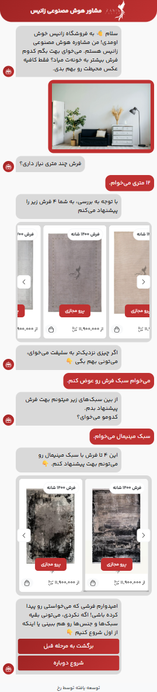

# چت‌بات دستیار هوش مصنوعی پیشنهاد فرش

**نوع پروژه:** وب‌اپلیکیشن فول‌استک  
**مشتری / کارفرما:** پروژه شخصی با فروش محدود

---

## 🎯 هدف پروژه

این چت‌بات به عنوان دستیاری برای وب‌سایت‌های فروش فرش و قالیچه است. ابزار با گرفتن تصاویر و اطلاعات و نیازمندی مشتری، فرش مناسب را پیشنهاد می‌کند.

---

## 🚫 دسترسی به کد

کد پروژه به دلیل ایده‌ی شخصی اعضای تیم، به صورت خصوصی نگه‌داری می‌شود.
با این حال، این چت‌بات روی فروشگاه فرش زانیس در [https://ai.zaniscarpet.com/](https://ai.zaniscarpet.com/) در دسترس است.

---

## 🔧 تکنولوژی‌ها و ابزارها

- Object Detection Models
- Python (Django)
- JavaScript (jQuery)
- MySQL
- Bootstrap

---

## 🧠 نقش من در پروژه

پیاده‌سازی کامل فرانت‌اند و بک‌اند، راه‌اندازی و پشتیبانی وب‌سایت

---

## 🧩 ویژگی‌های کلیدی پروژه

- سرعت فوق‌العاده بالا با توجه به استفاده از مدل هوش مصنوعی
- پیاده سازی به صورت چت‌بات
- امکان تعامل با بات برای دریافت پیشنهادات بیشتر
- کاملاً ریسپانسیو و قابل استفاده در موبایل

---

## 🖼️ تصاویر / دموی پروژه

  
  

