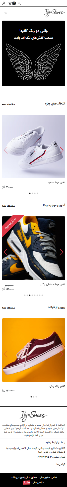
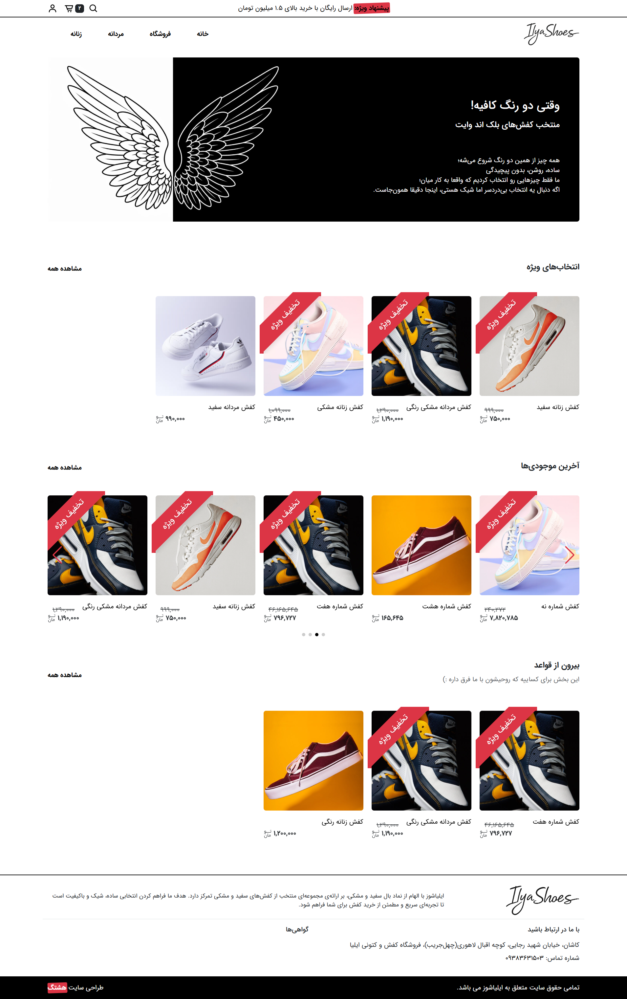

# فروشگاه اینترنتی ایلیاشوز

**نوع پروژه:** وب‌اپلیکیشن فول‌استک  
**مشتری / کارفرما:** پروژه خصوصی برای یک مشتری

---

## 🎯 هدف پروژه

وب‌سایت فروشگاهی برای فروش محصولات آنلاین

---

## 🚫 دسترسی به کد

پروژه در حال توسعه‌است و بعد از اتمام و اجرا، به صورت عمومی در دسترس قرار می‌گیرد.

---

## 🔧 تکنولوژی‌ها و ابزارها

- Python (Django)
- JavaScript
- MySQL
- Bootstrap

---

## 🧠 نقش من در پروژه

پیاده‌سازی کامل فرانت‌اند و بک‌اند، راه‌اندازی و پشتیبانی وب‌سایت

---

## 🧩 ویژگی‌های کلیدی پروژه

- فروشگاه اینترنتی مینیمال اختصاصی
- داشبورد مدیریتی کامل
- امکان بارگذاری تصاویر و مدیریت فایل‌ها
- کاملاً ریسپانسیو و قابل استفاده در موبایل

---

## 🖼️ تصاویر / دموی پروژه

  
  

