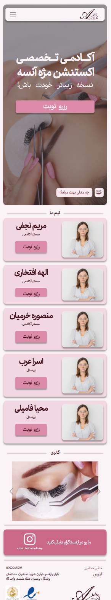
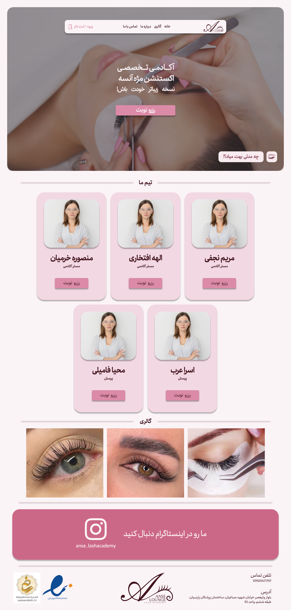
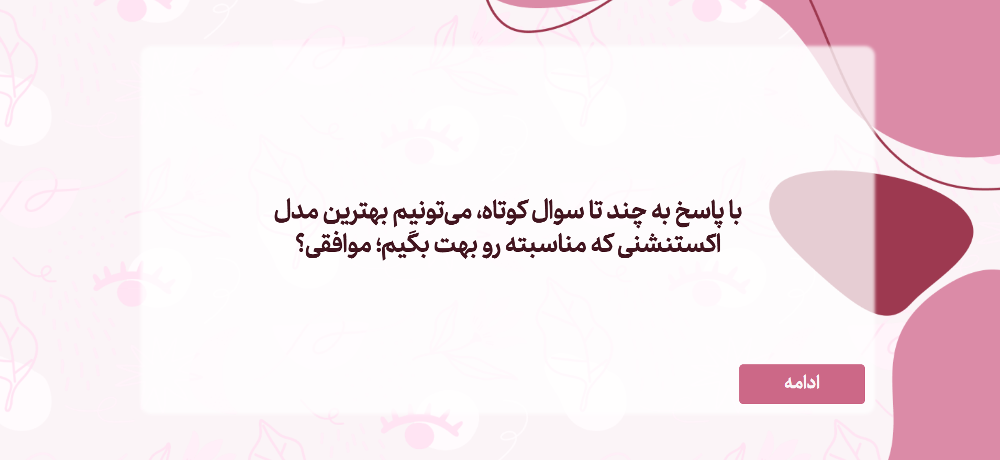
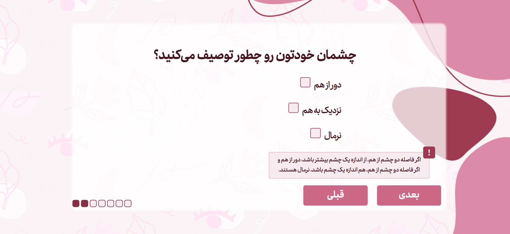
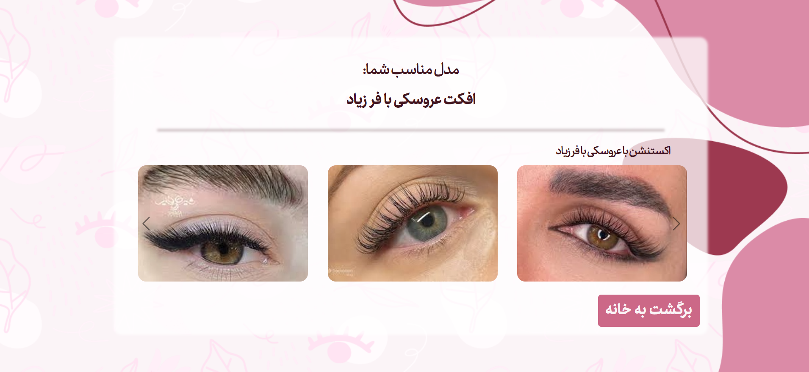

# وب سایت رزرو نوبت آکادمی تخصصی مژه

**نوع پروژه:** وب‌سایت رزرو نوبت
**مشتری / کارفرما:** پروژه خصوصی برای یک مشتری

---

## 🎯 هدف پروژه

ارائه بستر آنلاین برای رزرو نوبت آکادمی و سالن

---

## 🔧 تکنولوژی‌ها و ابزارها

- Python (Django)
- JavaScript (jQuery)
- MySQL
- Bootstrap

---

## 🧠 نقش من در پروژه

پیاده‌سازی کامل فرانت‌اند و بک‌اند

---

## 🚫 دسترسی به کد

کد پروژه به دلیل رعایت حریم خصوصی مشتری به صورت خصوصی نگه‌داری می‌شود.

---

## 🧩 ویژگی‌های کلیدی پروژه

- طراحی و اجرای تخصصی استایل کوییز برای کاربران
- داشبورد مدیریتی با فیلتر، جست‌وجو و آمارگیری
- امکان بارگذاری تصاویر و مدیریت فایل‌ها
- کاملاً ریسپانسیو و قابل استفاده در موبایل

---

## 🖼️ تصاویر / دموی پروژه

