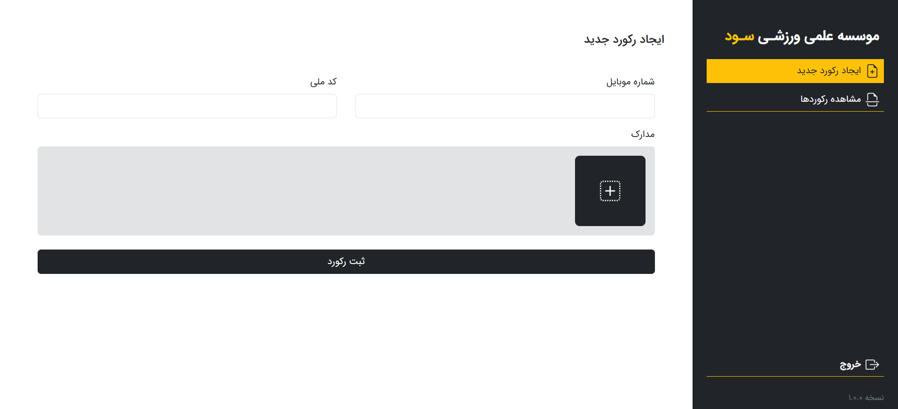
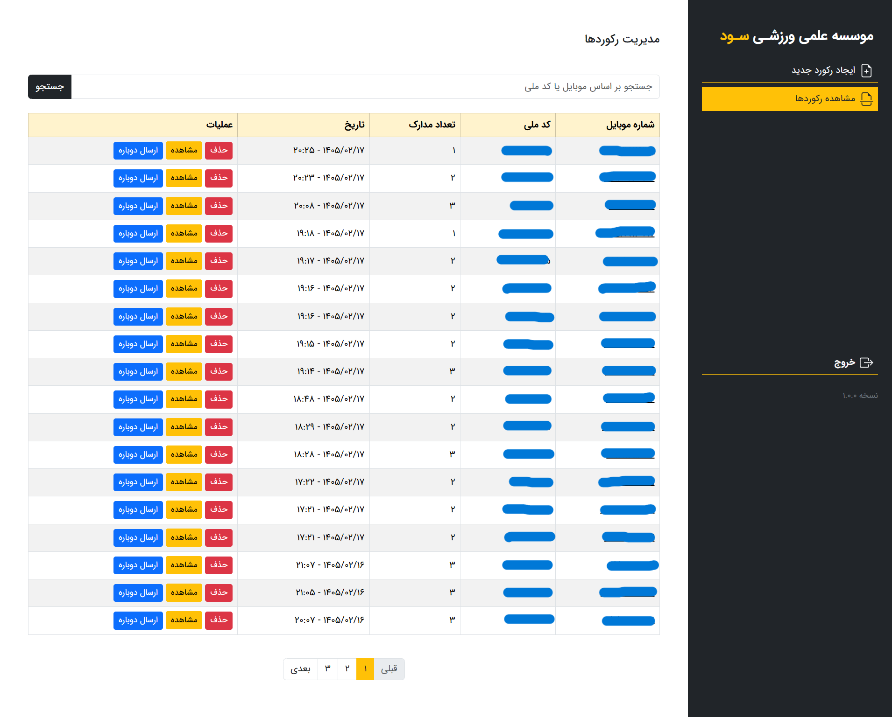

# وب‌سایت مدیریتی کلینیک ورزشی سود

**نوع پروژه:** وب‌اپلیکیشن فول‌استک  
**مشتری / کارفرما:** پروژه خصوصی برای یک مشتری

---

## 🎯 هدف پروژه

پنل مدیریت کلینیک برای ذخیره و اطلاع رسانی نتایج آزمایشات بیماران

---

## 🚫 دسترسی به کد

کد پروژه به دلیل رعایت حریم خصوصی مشتری به صورت خصوصی نگه‌داری می‌شود.  
همچنین نسخه آنلاین پروژه به‌صورت محدود در دسترس است و برای ایندکس‌شدن توسط موتورهای جست‌وجو تنظیم نشده است.

---

## 🔧 تکنولوژی‌ها و ابزارها

- Python (Django)
- JavaScript
- MySQL
- Bootstrap

---

## 🧠 نقش من در پروژه

پیاده‌سازی کامل فرانت‌اند و بک‌اند، راه‌اندازی و پشتیبانی وب‌سایت

---

## 🧩 ویژگی‌های کلیدی پروژه

- اتصال FTP به هاست دانلود برای ذخیره سازی مدارک
- ارسال پیام اطلاع رسانی
- کاملاً ریسپانسیو و قابل استفاده در موبایل

---

## 🖼️ تصاویر / دموی پروژه

